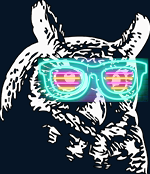
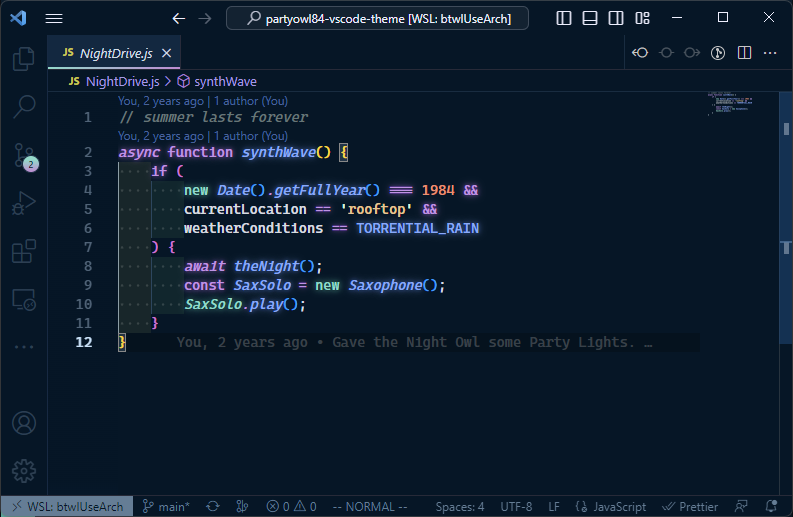

# Party Owl '84 - VS Code theme




This colour scheme is a variant of Robb0wen's SynthWave '84 based on sdras' Night Owl VS Code theme, installation and disclaimer are much the same as SynthWave '84's.

## Installation

To begin with, [install the base theme from the VS Marketplace](https://marketplace.visualstudio.com/items?itemName=sabrsorensen.party-owl-84). This is the way Party Owl '84 is intended to be used day-to-day. If you want to enable the gratuitous 80s glow, it needs a little extra work to get it going.

### Disclaimer

VS code doesn't natively support text effects and as a result, the glow is experimental. It's likely to be buggy and, whilst it looks rad, it isn't intended for extended use. To enable the glow, the extension has to modify the internal files of VS Code, so use with caution. Should something go wrong, you can disable the glow by following the instructions below. If for any reason you can't open VS Code, you can fix the issue with a fresh install of VS Code.

If you do decide use the glow effect, you do so at your own risk. Bring your Sunglasses. Here be (laser)dragons.

### To enable the glow

Firstly, if you are a Windows user, you may need to run VS Code with administrator privileges. For Linux and Mac users, Code must not be installed in a read-only location and you must have write permissions.

To activate the glow, Set your active colour theme to Party Owl '84. Open your command palette with `Ctrl + Shift + P` or `Shift + ⌘ + P` and choose "**Enable Party Lights**". It will prompt you to restart, and when you do the lights should be on :)

#### To customise the glow brightness

In your `settings.json` add the key:

```
"partyowl84.brightness": "0.45"
```

The value should be a _float value_ from 0 to 1, where 0.0 is fully transparent. The default brightness is 0.45. To avoid eye strain, avoid using higher brightness values for extended periods of time.

To see the changes, you need to rerun the activation function. Open your command palette with `Ctrl + Shift + P` or `Shift + ⌘ + P` and choose "**Enable Party Lights**".

Note: Changing the brightness currently only affects the opacity of the glow, the text will remain white (that may change in future updates). If you want to disable the glow effect but retain the chrome updates, see below.

#### To enable editor chrome updates, but disable glow

In your `settings.json` add the key:

```
"partyowl84.disableGlow": true
```

To see the changes, you need to rerun the activation function. Open your command palette with `Ctrl + Shift + P` or `Shift + ⌘ + P` and choose "**Enable Party Lights**".

### To remove corruption warning and [unsupported] from title-bar

Because enabling the glow modifies core files, VS code will interpret this as the core being 'corrupted' and you may see an error message on restarting your editor. You can safely dismiss this message, or remove it entirely with the [Fix VSCode Checksums](https://marketplace.visualstudio.com/items?itemName=lehni.vscode-fix-checksums "Fix VSCode Checksums") extension.

Upon installation of 'Fix VSCode Checksums', open the command palette and execute `Fix Checksums: Apply`. You will need to completely restart VSCode after execution, reopening without fully exiting might not be enough.

## Updates

Every time you update VS code, you will need to repeat this step to re-enable the glow.

## Disabling the glow and uninstallation

The glow effect started as a joke and was never intended for long-term coding sessions. If you want to turn it off, you can disable it at any time by opening your command palette with `Ctrl + Shift + P` or `Shift + ⌘ + P` and choose "**Disable Party Lights**".

## Compatibility

This theme is still **very much a work in progress**. I primarily develop in C#, Docker, shell, and Python, so, whilst those language sets should look pretty good, there will likely be issues for other languages. I'll work on adding more support as I go. If you find anything glaringly wrong, raise an issue and I'll try to fix it as soon as I can.

## Thanks

Standing on the shoulders of giants, this wouldn't be possible without Robb0wen's original SynthWave '84 and neon glow developed there and sdras' Night Owl colors. The original Thanks preserved below:

> Lastly, I couldn't have made this if it weren't for the fantastic work of [Sarah Drasner](https://twitter.com/sarah_edo). Her [tutorial on theming for CSS tricks](https://css-tricks.com/creating-a-vs-code-theme/) was a huge help in developing this 🙏

> Similarly, I'd like to thanks [Wes Bos](https://twitter.com/wesbos) for his [cool Cobalt2 theme](https://github.com/wesbos/cobalt2-vscode). His readme helped me figure out how to package this hot mess for public use 👍

> If this theme is too much, then I recommend [Horizon](https://github.com/jolaleye/horizon-theme-vscode), or [City Lights](http://citylights.xyz/) for a similar, yet more understated, retro vibe. They're both beautiful.
